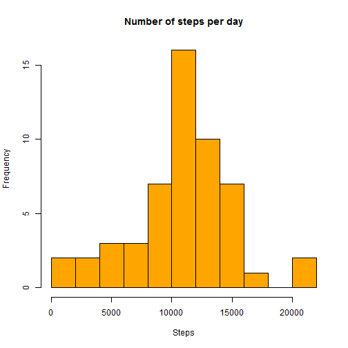

## Introduction
It is now possible to collect a large amount of data about personal movement using activity monitoring devices such as a Fitbit, Nike Fuelband, or Jawbone Up. These type of devices are part of the "quantified self" movement, a group of enthusiasts who take measurements about themselves regularly to improve their health, to find patterns in their behavior, or because they are tech geeks.

This analysis makes use of data from a personal activity monitoring device. This device collects data at 5 minute intervals through out the day. The data consists of two months of data from an anonymous individual collected during the months of October and November, 2012 and include the number of steps taken in 5 minute intervals each day.

Dataset: Activity monitoring data [activity.csv] in the GitHub repository
The variables included in this dataset are:
* steps: Number of steps taking in a 5-minute interval (missing values are coded as NA)
* date: The date on which the measurement was taken in YYYY-MM-DD format
* interval: Identifier for the 5-minute interval in which measurement was taken

The dataset is stored in a comma-separated-value (CSV) file and there are a total of 17,568 observations in this dataset.

## Loading and preprocessing the data

```r
setwd("~/Personal-Folder/Study-Git/reprod-research-wk1a/RepData_PeerAssessment1")
activity_df <- read.csv("activity.csv", header=T, sep=",")
```

## What is mean total number of steps taken per day?

```r
steps_per_day_df <- aggregate(activity_df$steps, by=list(activity_df$date), FUN=sum)
names(steps_per_day_df) <- c("date","steps")
hist(steps_per_day_df$steps, 
     main="Number of steps per day",
     breaks=10, 
     col="orange", 
     xlab="Steps")
```



```r
mean_steps_per_day <- mean(steps_per_day_df$steps, na.rm=T)
median_steps_per_day <- median(steps_per_day_df$steps, na.rm=T)
```

## What is the average daily activity pattern?


## Imputing missing values


## Are there differences in activity patterns between weekdays and weekends?
